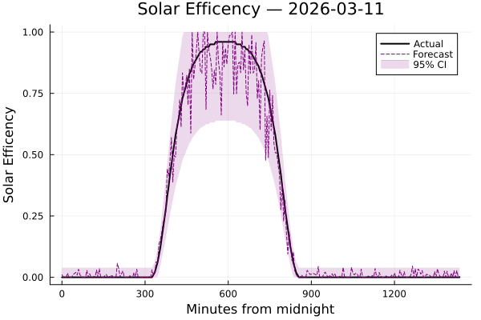
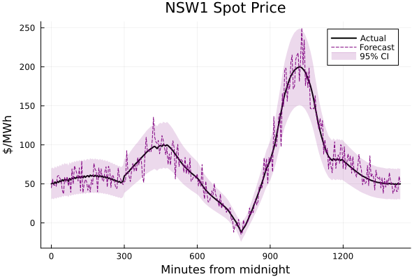
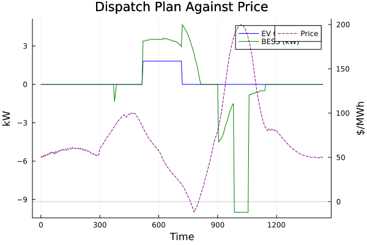
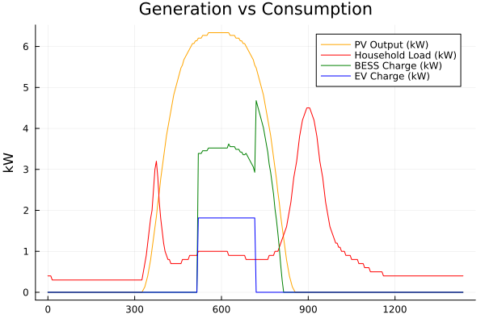

# EV & BESS optimisation

This project demonstrates how to isolate energy resource optimisation from a
DERMS platform. The optimisation uses the [HiGHS](https://highs.dev)
solver to optimise an EV and BESS against a spot price. This optimisation
takes into account constraints on the resources such as BESS degradation due
to cycling and API costs to "wake up" an EV (applicable to various EV models).

The optimiser will optimise an arbitrary number of EVs, BESSs consider price
, load and solar predictions. The task of generating the predictions is left
to the client. An example request body is available in the [data folder](./data).

## Gateway

An API gateway for logging, security and usage-tracking is available in the
[gateway directory](./gateway/). This will wrap up the optimisation service
with enough management utilities to turn it into an internal or external
product.

## Optimisation

The optimisation is a stateless solver that optimises for total cost of the
system for the owner. This optimisation consider factors like battery health,
PV capacity and predictions.

## Usage & Technical Details

The optimisation sub-system offers a single HTTP endpoint to solve an optimisation.
The gateway proxies this endpoint and adds various middleware for observability.

The gateway provides a minimal set of administration features. These features are:

- Request tracing with request ids
- Error logging and panic handling
- API key authentication
- Accounts for various entities that will use the API
- Rate limiting by account
- An admin API for debugging requests and monitoring usage

The gateway uses sqlite3 for storing API keys accounts and request logs.

### Accounts and API keys

The authentication model uses accounts and API keys. An account identifies
an agent (organisation or user) who uses the API. An API key identifies a
piece of software belonging to an account. All API keys are associated
with a single account. All interactions with the API are treated as an
interaction with the account who owns the API key.

Accounts may be identified as admin accounts by including the account
name in the `admin-accounts` flag when starting the application. Admin
accounts are able to query the usage of other accounts as well as see
request logs for requests.

### A note on scaling

The system is designed to be partitioned by accounts (each account uses)
a single partition. While the exact mechanics of how that should happen are
outside the scope of this doc; it is worth noting that trying to add all
accounts to a single instance will degrade the data model.

### Request Tracking

All responses include a `X-Request-ID` header which can be used to
access logs for the request. Additionally, admin accounts can use
the endpoint `admin/request/{RequestID}` to view the full details
of the request. This is particularly important when debugging
interactions between the optimiser and the gateway.

### Getting a optimisation

This endpoint creates a number of EV and BESS plans given a set of
predictions and site configurations.

```fish
curl $HOST/api/v1-alpha/plan -i \
  -d "$(cat data/req_body.json )" \
  -H "X-API-KEY: $api_key"
```

### Operation Scripts

Useful scripts of operations are available in the [scripts file.](./gateway/admin.fish)
These scripts use the [fish](https://fishshell.com/) scripting language.
To load the scripts run `source ./gateway/admin.fish` in a fish shell
and then you can call each function.

```fish
# Create a new api key
create-key "Some Account" somme-account

# Create an accout in a non default db
create-key "Some Account" somme-account --db "somedb.db"

# Create a database file
init-db

# Or
init-db --db optimisation-account-a.sql
```

There are also scripts for using the API:

```fish
set -l optimisation_api_key "urn:optimisation:api_key:xxxyyyzzz"

# Send a request file to generate an optimised plan.
optimise data/req_body.json

# To view the details of a request (only for admin accounts)
request_details $request_id | jq
```

## Running Pluto

From the root directory run `julia` `activate mipaas` and `import Pluto; Pluto.run()`.

### Example with pictures

This example uses simulated predictions with confidence intervals that
will help for future work to create best/worst case optimisations, for now
it is safe to ignore the confidence intervals.

We simulate some price and solar predictions for a day we want to optimise:





We provide the following configuration for assets to optimise:

```json
{
  "evs": [{"capacity_kwh":56,"max_charge_kw":7.0,"soc":0.14}],
  "pv": {"capacity_kw":6.6},
  "bess": [{"capacity_kwh":41.0,"max_charge_kw":11.0,"max_discharge_kw":10.0,"efficiency":0.9,"soc":0.51}]
}
```

And we get a nice plan for when to dispatch the BESS and EV.



Note the first BESS dispatch is to cover the morning load (which isn't visualised).



## API Docs

[API Docs](/api.md)
